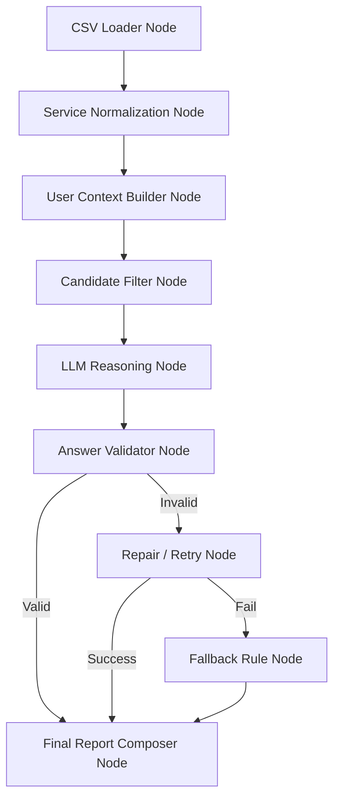

# Welfare Intelligence Pipeline (WIP) 설계 문서

**최종 업데이트**: 2025-12-06
**GPS API 연동 완료**: 
> **"LLM-enabled Decision Pipeline"**

## 1. 개요 (Overview)
- **기능 명칭**: 맞춤형 이동 복지 리포트 (Custom Mobility Welfare Report)
- **목적**: 사용자의 GPS 이동 패턴과 개인 정보를 분석하여, 맞춤형 복지 서비스를 추천하고 이동 생활의 리스크를 관리한다.
- **핵심 철학**: 
    - LLM은 의사결정자가 아닌, **"설명 생성기(Explanation Generator)"**이자 **"파이프라인의 하나의 노드(Node)"**로 작동한다.
    - 실시간 생성이 아닌, **"안정된 배치 파이프라인"**을 통해 신뢰성 있는 JSON 리포트를 생성한다.
    - AI가 실패해도 시스템은 무너지지 않는 **Fallback 구조**를 갖춘다.

## 2. 시스템 아키텍처 (System Architecture)
### 2.1. 전체 파이프라인 흐름
LangGraph 확장성을 고려한 노드 단위 설계



### 2.2. 각 노드(Node)의 역할
| 노드 (Node) | 역할 (Role) | 주요 로직 |
|:---:|:---|:---|
| **CSV Loader** | 복지 서비스 데이터 로딩 | `loadServices()`: CSV 파싱, 인코딩 처리 |
| **Normalization** | 서비스 태그화 및 정규화 | `normalizeService()`: 연령(노인/아동), 이동성 관련 여부 태깅 |
| **GPS Data Fetcher** | **[NEW]** 실제 주행 데이터 조회 | `fetchRecentMileage()`: 성동구 API 연동, 최근 7일 주행거리/시간 집계 |
| **User Context** | 사용자 상태 컨텍스트 생성 | `buildUserContext()`: GPS 집계(주간Km, 활동일수, 추세), 개인정보 결합 |
| **Candidate Filter** | **[핵심]** 추천 후보군 선정 | `selectCandidates()`: Rule-based 필터링 (LLM 개입 X) |
| **LLM Reasoning** | 설명 및 요약 생성 (자연어) | 프롬프트 엔지니어링을 통해 JSON 포맷의 설명문 생성 (GPT-4o-2024-11-20) |
| **Validator** | 결과 검증 (AI 감시자) | JSON 파싱 여부, 서비스명 일치 여부, 필수 필드 확인 |
| **Repair/Fallback** | 실패 시 대응 | 재시도 또는 Rule-based 기본 리포트 생성 |

### 2.3. GPS API 연동 (성동구 주행 데이터)
**API 명세**: `/functions/data/성동구API명세서.csv`
**사용자 매핑**: `/functions/data/사용자센서정보.csv`

- **Endpoint**: `https://test-web2.star-pickers.com/v2/vehicle/mileage`
- **Method**: POST
- **Request Body**:
  ```json
  {
    "RD_DT": "2025-11-17",
    "SNR_ID": "450088830167710"  // Optional
  }
  ```
- **Response**:
  ```json
  {
    "STATUS": "SUCCESS",
    "RESULT": [
      {
        "SNR_ID": "450088830167710",
        "RD_DT": "2025-11-17",
        "TOT_TM": "2.1767",    // 총 주행시간 (시간)
        "TOT_DTN": "8.412"     // 총 주행거리 (km)
      }
    ]
  }
  ```
- **데이터 특성**:
  - 2025년 8월 7일부터 데이터 적재
  - 실시간이 아닌 10분 텀으로 집계
  - 7월 데이터는 추후 업데이트 예정

## 3. 데이터 모델링 (Firestore Schema)

### 3.1. `welfare_services` (복지 서비스 마스터)
- 배치 파이프라인의 소스 데이터 (CSV에서 변환)
```typescript
interface WelfareService {
  serviceId: string;      // 고유 ID
  name: string;           // 서비스명
  ministry: string;       // 소관 부처
  summary: string;        // 서비스 요약
  year: number;           // 기준 연도
  tags: {
    age: "elder" | "adult" | "all";
    mobility: boolean;    // 이동 관련 서비스 여부
  };
}
```

### 3.2. `user_welfare_reports` (생성된 리포트 결과)
- 앱은 이 컬렉션을 조회하여 화면에 표시함 (실시간 계산 X)
```typescript
interface UserWelfareReport {
  userId: string;
  createdAt: Timestamp;   // 생성 일시
  period: {               // 분석 기간
    start: Timestamp;
    end: Timestamp;
  };
  summary: string;        // [LLM] 이동 패턴 요약 (1~2문장)
  risk: string;           // [LLM] 리스크 분석 (1문장)
  services: {             // [LLM] 추천 서비스 목록 (최대 3개)
    name: string;
    reason: string;
    link?: string;
  }[];
  metadata: {             // 분석 메타데이터 (디버깅/검증용)
    weeklyKm: number;
    trend: "increase" | "decrease" | "stable";
    isFallback: boolean;  // LLM 실패로 인한 Fallback 여부
  };
}
```

## 4. UI/UX 설계 (soo-ri App)

### 4.1. 진입점: 하단 네비게이션 '복지(Welfare)' 탭 신설
- **위치**: 하단 탭 바의 중앙 또는 우측
- **아이콘**: 선물 상자 또는 문서 아이콘
- **명칭**: "복지" 또는 "내 리포트"

### 4.2. 화면 구성 (Text-only Report 활용)
1. **헤더**: "000님의 이번 주 이동 리포트"
2. **요약 카드 (Summary & Risk)**
   - 배경: 따뜻한 파스텔 톤
   - 내용: `summary` 텍스트 표시
   - 알림: `risk` 텍스트를 강조된 박스(주의/안내)로 표시
3. **추천 서비스 리스트 (Services)**
   - 타이틀: "맞춤형 복지 서비스 추천"
   - 리스트 아이템:
     - **서비스명** (Bold)
     - **추천 사유** (`reason`)
     - **자세히 보기** 버튼 (외부 링크)

## 5. 구현 로드맵 (Week 1)

### Phase 1: 기반 마련 (Day 1-2)
- [ ] `WelfareService` CSV 데이터 확보 및 전처리 로직 구현 (`welfare_services` 컬렉션 적재)
- [ ] 사용자 GPS 데이터 집계 로직 구현 (`User Context Builder`)

### Phase 2: 파이프라인 구축 (Day 3-4)
- [ ] `Candidate Filter` (Rule-based) 구현
- [ ] **LLM Integration**: System Prompt 작성 및 Cloud Functions 연동
- [ ] `Validator` & `Fallback` 로직 구현

### Phase 3: 연동 및 UI (Day 5)
- [ ] Cloud Functions 배치 스케줄러 설정 (Pub/Sub)
- [ ] soo-ri 앱 '복지' 탭 UI 구현 및 데이터 바인딩
- [ ] README 및 아키텍처 다이어그램 정리 (포트폴리오용)

## 6. 확장성 (Future Work)
- **LangGraph 도입**: 현재의 노드 함수들을 LangGraph State Node로 그대로 변환
- **RAG 시스템**: 단순 CSV 검색을 넘어, 관련 법령/사례 문서를 검색하여 근거 강화
- **피드백 루프**: 사용자의 서비스 클릭/신청 여부를 반영하여 추천 알고리즘 개선
