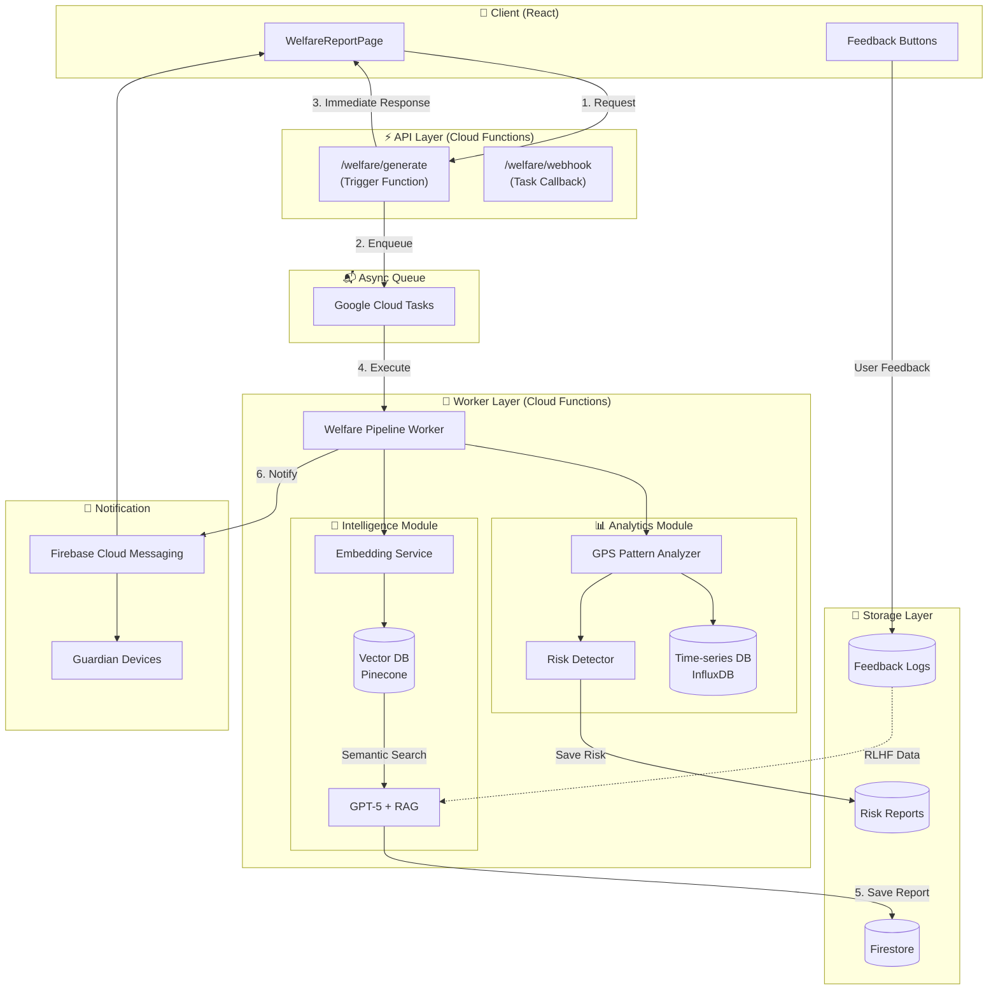
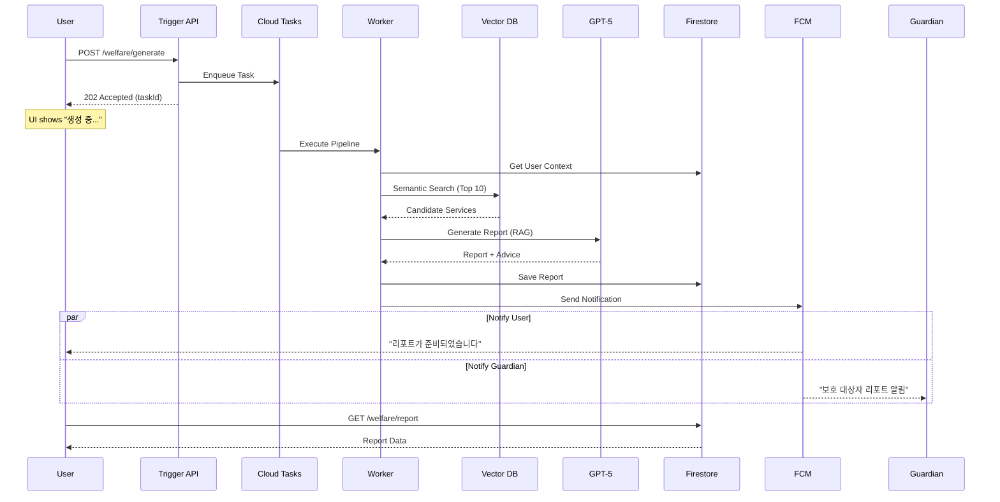

# 수리수리 복지 리포트 V2 구현 로드맵

> **문서 버전**: 1.0  
> **작성일**: 2025년 12월 15일  
> **목적**: V2 진화 전략의 구체적인 구현 계획 및 기술 명세

---

## 📋 목차

1. [V2 비전 및 목표](#1-v2-비전-및-목표)
2. [시스템 아키텍처 (V2)](#2-시스템-아키텍처-v2)
3. [데이터베이스 스키마 변경](#3-데이터베이스-스키마-변경)
4. [구현 Phase 계획](#4-구현-phase-계획)
5. [핵심 모듈 상세 설계](#5-핵심-모듈-상세-설계)
6. [기술 선택 근거](#6-기술-선택-근거)
7. [포트폴리오 토킹 포인트](#7-포트폴리오-토킹-포인트)
8. [리스크 및 대응 전략](#8-리스크-및-대응-전략)
9. [기존 시스템 호환성 검토](#9-기존-시스템-호환성-검토) ⭐
10. [RAG와 LangGraph 기술 스택 심층 분석](#10-rag와-langgraph-기술-스택-심층-분석) ⭐
11. [개발자/엔지니어로서의 의미 도출](#11-개발자엔지니어로서의-의미-도출) ⭐

---

## 1. V2 비전 및 목표

### 1.1 핵심 비전

```
"정적 정보 제공 앱"에서 "행동 유도형 인텔리전스 플랫폼"으로의 전환
```

### 1.2 V2 목표

| 목표 | 측정 지표 | 목표치 |
|------|-----------|--------|
| **확장성** | 동시 처리 가능 요청 수 | 1,000+ req/min |
| **AI 정확도** | 추천 서비스 만족도 | 80%+ |
| **리텐션** | 주간 활성 사용자 비율 | 40%+ |
| **데이터 가치** | B2G 제안 가능 인사이트 | 월 10건+ |

### 1.3 V1 vs V2 비교

| 영역 | V1 (MVP) | V2 (Evolution) |
|------|----------|----------------|
| **처리 방식** | 동기식 (Synchronous) | 비동기 이벤트 기반 (Event-Driven) |
| **AI 검색** | Rule-based 태그 매칭 | Vector Search (Semantic RAG) |
| **데이터 활용** | 단순 통계 (합계, 추세) | 패턴 분석 (위험 감지, 예측) |
| **사용자 상호작용** | 조회 (Read-only) | 피드백 + 알림 (Actionable) |
| **보호자 연동** | 미구현 | Guardian Mode (FCM 알림) |

---

## 2. 시스템 아키텍처 (V2)

### 2.1 전체 아키텍처 다이어그램



### 2.2 데이터 흐름 (Sequence)



### 2.3 컴포넌트 책임

| 컴포넌트 | 책임 | 기술 |
|----------|------|------|
| **Trigger API** | 요청 검증, Task 생성, 즉시 응답 | Cloud Functions |
| **Cloud Tasks** | 작업 큐잉, 재시도, 스케줄링 | Google Cloud Tasks |
| **Worker** | 파이프라인 실행, 리포트 생성 | Cloud Functions (Gen 2) |
| **Vector DB** | 복지 서비스 임베딩 저장/검색 | Pinecone |
| **Time-series DB** | GPS 데이터 시계열 저장/분석 | InfluxDB Cloud |
| **FCM** | 푸시 알림 발송 | Firebase Cloud Messaging |

---

## 3. 데이터베이스 스키마 변경

### 3.1 신규 컬렉션

#### `welfare_service_embeddings` (Vector DB - Pinecone)

```typescript
interface ServiceEmbedding {
  id: string                    // serviceId
  values: number[]              // 1536-dim embedding vector
  metadata: {
    name: string
    summary: string
    ministry: string
    tags: string[]              // ['mobility', 'disability', 'elder']
    year: number
    link: string
  }
}
```

#### `user_feedback` (Firestore)

```typescript
interface UserFeedback {
  id: string                    // auto-generated
  
  // 참조
  userId: string
  reportId: string
  serviceId: string
  
  // 피드백 데이터
  feedbackType: 'helpful' | 'not_helpful' | 'applied' | 'dismissed'
  comment?: string              // 선택적 코멘트
  
  // 메타데이터
  createdAt: Timestamp
  userContext: {                // 피드백 시점의 사용자 상태 (RLHF용)
    recipientType: string
    weeklyKm: number
    trend: string
  }
}
```

#### `risk_reports` (Firestore)

```typescript
interface RiskReport {
  id: string                    // auto-generated
  
  // 위험 유형
  riskType: 'battery_warning' | 'danger_zone' | 'health_alert' | 'maintenance_due'
  severity: 'low' | 'medium' | 'high' | 'critical'
  
  // 대상
  userId: string
  vehicleId?: string
  
  // 상세 정보
  description: string
  data: {
    // battery_warning
    estimatedBatteryHealth?: number
    mileageSinceLastCharge?: number
    
    // danger_zone
    coordinates?: { lat: number, lng: number }
    incidentCount?: number
    
    // health_alert
    activityDecreasePercent?: number
    daysSinceLastActivity?: number
    
    // maintenance_due
    daysSinceLastCheck?: number
    recommendedAction?: string
  }
  
  // 상태
  status: 'detected' | 'notified' | 'resolved' | 'dismissed'
  notifiedAt?: Timestamp
  resolvedAt?: Timestamp
  
  // 메타데이터
  createdAt: Timestamp
  updatedAt: Timestamp
}
```

#### `gps_events` (InfluxDB - Time-series)

```typescript
// InfluxDB Line Protocol 형식
interface GPSEvent {
  measurement: 'wheelchair_movement'
  tags: {
    sensor_id: string
    user_id: string
    district: string
  }
  fields: {
    distance: number            // km
    speed: number               // km/h
    acceleration: number        // m/s²
    battery_level?: number      // %
    temperature?: number        // °C
  }
  timestamp: number             // Unix nanoseconds
}
```

### 3.2 기존 컬렉션 변경

#### `users` (추가 필드)

```typescript
interface User {
  // 기존 필드...
  
  // V2 추가
  fcmTokens: string[]           // 푸시 알림용 토큰 배열
  notificationPreferences: {
    reportReady: boolean        // 리포트 생성 완료 알림
    riskAlert: boolean          // 위험 알림
    weeklyDigest: boolean       // 주간 요약 알림
  }
  guardianNotificationEnabled: boolean  // 보호자 알림 활성화
}
```

#### `user_welfare_reports` (추가 필드)

```typescript
interface WelfareReport {
  // 기존 필드...
  
  // V2 추가
  generationMethod: 'sync_v1' | 'async_v2'
  taskId?: string               // Cloud Tasks ID
  
  // RAG 메타데이터
  ragMetadata?: {
    queryEmbedding: number[]    // 사용자 쿼리 임베딩
    retrievedServiceIds: string[]
    similarityScores: number[]
  }
  
  // 피드백 집계
  feedbackSummary?: {
    helpfulCount: number
    notHelpfulCount: number
    appliedCount: number
  }
  
  // 위험 분석 결과
  riskAnalysis?: {
    batteryRisk: 'low' | 'medium' | 'high'
    activityRisk: 'low' | 'medium' | 'high'
    maintenanceRisk: 'low' | 'medium' | 'high'
  }
}
```

---

## 4. 구현 Phase 계획

### 4.1 Phase 개요

```
┌─────────────────────────────────────────────────────────────────────┐
│                        V2 Implementation Phases                      │
├─────────────────────────────────────────────────────────────────────┤
│                                                                     │
│  Phase 1: Foundation (2주)                                          │
│  ├── 비동기 아키텍처 전환                                            │
│  ├── Cloud Tasks 연동                                               │
│  └── FCM 푸시 알림 기본 구현                                         │
│                                                                     │
│  Phase 2: Intelligence (3주)                                        │
│  ├── Vector DB 구축 (Pinecone)                                      │
│  ├── RAG 파이프라인 구현                                             │
│  └── 피드백 루프 구현                                                │
│                                                                     │
│  Phase 3: Insight (2주)                                             │
│  ├── GPS 패턴 분석                                                   │
│  ├── 위험 감지 시스템                                                │
│  └── Guardian Mode 완성                                             │
│                                                                     │
└─────────────────────────────────────────────────────────────────────┘
```

### 4.2 Phase 1: Foundation (2주)

#### 목표
- 동기식 → 비동기식 아키텍처 전환
- 시스템 안정성 및 확장성 확보

#### 태스크

| 태스크 | 설명 | 예상 공수 |
|--------|------|-----------|
| **1.1** Cloud Tasks 설정 | GCP 프로젝트에 Cloud Tasks 활성화, 큐 생성 | 2h |
| **1.2** Trigger Function 구현 | 요청 검증, Task 생성, 즉시 응답 | 4h |
| **1.3** Worker Function 구현 | 기존 파이프라인을 Worker로 분리 | 4h |
| **1.4** 상태 관리 | 리포트 생성 상태 (pending/processing/completed/failed) | 3h |
| **1.5** FCM 기본 연동 | 리포트 완료 시 푸시 알림 발송 | 4h |
| **1.6** 프론트엔드 수정 | 비동기 UX (로딩 상태, 폴링/실시간 업데이트) | 6h |
| **1.7** 테스트 및 배포 | 통합 테스트, 스테이징 배포 | 4h |

#### 산출물
- `functions/welfare/triggerFunction.js`
- `functions/welfare/workerFunction.js`
- `functions/notifications/fcmService.js`
- 수정된 프론트엔드 (비동기 UX)

### 4.3 Phase 2: Intelligence (3주)

#### 목표
- RAG 기반 의미론적 검색 도입
- 사용자 피드백 수집 및 활용

#### 태스크

| 태스크 | 설명 | 예상 공수 |
|--------|------|-----------|
| **2.1** Pinecone 설정 | 인덱스 생성, API 연동 | 3h |
| **2.2** 임베딩 파이프라인 | 복지 서비스 데이터 임베딩 생성 및 업로드 | 6h |
| **2.3** 쿼리 임베딩 | 사용자 컨텍스트를 쿼리 벡터로 변환 | 4h |
| **2.4** Hybrid Search | Vector Search + Keyword Filter 조합 | 6h |
| **2.5** RAG 프롬프트 개선 | 검색 결과 기반 프롬프트 재설계 | 4h |
| **2.6** 피드백 UI | 서비스별 [도움됨]/[도움안됨] 버튼 | 4h |
| **2.7** 피드백 저장 | Firestore에 피드백 로그 저장 | 3h |
| **2.8** 피드백 반영 | 다음 추천 시 피드백 데이터 활용 | 6h |
| **2.9** 테스트 및 배포 | A/B 테스트 설정, 정확도 측정 | 6h |

#### 산출물
- `functions/welfare/embeddingService.js`
- `functions/welfare/vectorSearch.js`
- `functions/welfare/ragNode.js`
- `functions/feedback/feedbackService.js`
- 피드백 UI 컴포넌트

### 4.4 Phase 3: Insight (2주)

#### 목표
- GPS 데이터 심층 분석
- 위험 감지 및 보호자 알림

#### 태스크

| 태스크 | 설명 | 예상 공수 |
|--------|------|-----------|
| **3.1** InfluxDB 설정 | InfluxDB Cloud 계정, 버킷 생성 | 2h |
| **3.2** GPS 데이터 수집 | 기존 API 데이터를 InfluxDB에 저장 | 4h |
| **3.3** 패턴 분석 알고리즘 | 급감속, 이상 패턴 탐지 로직 | 8h |
| **3.4** 위험 감지 서비스 | 배터리 위험, 활동 감소, 위험 구간 탐지 | 8h |
| **3.5** Risk Report 생성 | 위험 감지 시 자동 리포트 생성 | 4h |
| **3.6** Guardian 알림 | 보호자에게 위험 알림 발송 | 4h |
| **3.7** B2G 데이터 구조화 | 위험 구간 데이터를 지자체 제출 형식으로 | 4h |
| **3.8** 테스트 및 배포 | 위험 시나리오 테스트, 프로덕션 배포 | 4h |

#### 산출물
- `functions/analytics/gpsAnalyzer.js`
- `functions/analytics/riskDetector.js`
- `functions/notifications/guardianNotifier.js`
- B2G 데이터 내보내기 기능

---

## 5. 핵심 모듈 상세 설계

### 5.1 비동기 처리 모듈

#### Trigger Function

```javascript
// functions/welfare/triggerFunction.js
const { CloudTasksClient } = require('@google-cloud/tasks');

exports.triggerWelfareReport = async (req, res) => {
  const { userId } = req.body;
  
  // 1. 요청 검증
  if (!userId) {
    return res.status(400).json({ error: 'userId required' });
  }
  
  // 2. 중복 요청 방지 (최근 5분 내 요청 확인)
  const recentTask = await checkRecentTask(userId);
  if (recentTask) {
    return res.status(429).json({ 
      error: 'Report generation in progress',
      taskId: recentTask.id 
    });
  }
  
  // 3. Cloud Task 생성
  const task = await createCloudTask({
    queue: 'welfare-report-queue',
    payload: { userId, requestedAt: Date.now() },
    scheduleTime: null  // 즉시 실행
  });
  
  // 4. 상태 저장
  await saveTaskStatus(userId, task.name, 'pending');
  
  // 5. 즉시 응답
  return res.status(202).json({
    message: '리포트 생성이 시작되었습니다',
    taskId: task.name,
    estimatedTime: '30초 ~ 1분'
  });
};
```

#### Worker Function

```javascript
// functions/welfare/workerFunction.js
exports.processWelfareReport = async (req, res) => {
  const { userId, requestedAt } = req.body;
  
  try {
    // 1. 상태 업데이트
    await updateTaskStatus(userId, 'processing');
    
    // 2. 파이프라인 실행 (V2)
    const report = await runWelfarePipelineV2(userId);
    
    // 3. 리포트 저장
    await saveReport(userId, report);
    
    // 4. 상태 업데이트
    await updateTaskStatus(userId, 'completed');
    
    // 5. 알림 발송
    await sendNotifications(userId, report);
    
    return res.status(200).json({ success: true });
    
  } catch (error) {
    await updateTaskStatus(userId, 'failed', error.message);
    console.error('Worker Error:', error);
    
    // Cloud Tasks가 재시도하도록 5xx 반환
    return res.status(500).json({ error: error.message });
  }
};
```

### 5.2 RAG 모듈

#### Embedding Service

```javascript
// functions/welfare/embeddingService.js
const OpenAI = require('openai');

const openai = new OpenAI({ apiKey: process.env.OPENAI_API_KEY });

exports.generateEmbedding = async (text) => {
  const response = await openai.embeddings.create({
    model: 'text-embedding-3-small',
    input: text,
    dimensions: 1536
  });
  
  return response.data[0].embedding;
};

exports.generateServiceEmbedding = async (service) => {
  // 서비스 정보를 하나의 텍스트로 결합
  const text = `
    서비스명: ${service.name}
    요약: ${service.summary}
    담당부처: ${service.ministry}
    대상: ${service.tags.join(', ')}
  `.trim();
  
  return exports.generateEmbedding(text);
};

exports.generateQueryEmbedding = async (userContext) => {
  // 사용자 컨텍스트를 쿼리 텍스트로 변환
  const text = `
    사용자 유형: ${userContext.recipientType}
    주간 이동거리: ${userContext.stats.weeklyKm}km
    이동 추세: ${userContext.stats.trend}
    최근 수리: ${userContext.stats.recentRepairs}회
    최근 점검: ${userContext.stats.recentSelfChecks}회
    필요한 복지 서비스 추천
  `.trim();
  
  return exports.generateEmbedding(text);
};
```

#### Vector Search

```javascript
// functions/welfare/vectorSearch.js
const { Pinecone } = require('@pinecone-database/pinecone');

const pinecone = new Pinecone({ apiKey: process.env.PINECONE_API_KEY });
const index = pinecone.index('welfare-services');

exports.searchSimilarServices = async (queryEmbedding, userContext, topK = 10) => {
  // Hybrid Search: Vector + Metadata Filter
  const filter = buildMetadataFilter(userContext);
  
  const results = await index.query({
    vector: queryEmbedding,
    topK,
    filter,
    includeMetadata: true
  });
  
  return results.matches.map(match => ({
    serviceId: match.id,
    score: match.score,
    ...match.metadata
  }));
};

function buildMetadataFilter(userContext) {
  const filter = {};
  
  // recipientType 기반 필터
  if (userContext.recipientType === 'general') {
    // 장애인/저소득 전용 서비스 제외
    filter.tags = { $nin: ['disability_only', 'low_income_only'] };
  }
  
  // 지역 필터 (있는 경우)
  if (userContext.district) {
    filter.$or = [
      { region: userContext.district },
      { region: '전국' }
    ];
  }
  
  return filter;
}
```

### 5.3 위험 감지 모듈

#### Risk Detector

```javascript
// functions/analytics/riskDetector.js

exports.analyzeRisks = async (userId, gpsData, userContext) => {
  const risks = [];
  
  // 1. 배터리 위험 분석
  const batteryRisk = analyzeBatteryRisk(gpsData, userContext);
  if (batteryRisk) risks.push(batteryRisk);
  
  // 2. 활동 감소 분석
  const activityRisk = analyzeActivityRisk(gpsData, userContext);
  if (activityRisk) risks.push(activityRisk);
  
  // 3. 위험 구간 분석
  const dangerZones = analyzeDangerZones(gpsData);
  risks.push(...dangerZones);
  
  // 4. 정비 필요 분석
  const maintenanceRisk = analyzeMaintenanceRisk(userContext);
  if (maintenanceRisk) risks.push(maintenanceRisk);
  
  return risks;
};

function analyzeBatteryRisk(gpsData, userContext) {
  // 주행 거리 대비 충전 패턴 분석
  const avgDailyDistance = gpsData.totalDistance / 7;
  const estimatedBatteryDrain = avgDailyDistance * 5; // 가정: 1km당 5% 소모
  
  if (estimatedBatteryDrain > 80) {
    return {
      riskType: 'battery_warning',
      severity: 'high',
      description: '일일 주행량이 많아 배터리 방전 위험이 있습니다',
      data: {
        estimatedBatteryHealth: 100 - estimatedBatteryDrain,
        avgDailyDistance
      }
    };
  }
  
  return null;
}

function analyzeActivityRisk(gpsData, userContext) {
  // 이동량 급감 감지
  if (gpsData.trend === 'decrease') {
    const decreasePercent = calculateDecreasePercent(gpsData);
    
    if (decreasePercent > 50) {
      return {
        riskType: 'health_alert',
        severity: 'medium',
        description: '최근 외부 활동이 크게 줄었습니다. 건강 상태를 확인해보세요.',
        data: {
          activityDecreasePercent: decreasePercent
        }
      };
    }
  }
  
  return null;
}

function analyzeDangerZones(gpsData) {
  // 급감속 이벤트 클러스터링
  const decelerationEvents = gpsData.events?.filter(e => e.type === 'hard_brake') || [];
  
  // 좌표 클러스터링 (간단한 그리드 기반)
  const clusters = clusterByLocation(decelerationEvents, 0.001); // ~100m 반경
  
  return clusters
    .filter(cluster => cluster.count >= 3) // 3회 이상 발생
    .map(cluster => ({
      riskType: 'danger_zone',
      severity: cluster.count >= 5 ? 'high' : 'medium',
      description: `이 구간에서 급정거가 ${cluster.count}회 발생했습니다`,
      data: {
        coordinates: cluster.center,
        incidentCount: cluster.count
      }
    }));
}
```

### 5.4 Guardian 알림 모듈

```javascript
// functions/notifications/guardianNotifier.js
const admin = require('firebase-admin');

exports.notifyGuardians = async (userId, riskReport) => {
  // 1. 사용자 정보 조회
  const user = await getUser(userId);
  
  if (!user.guardianNotificationEnabled || !user.guardianIds?.length) {
    return { sent: false, reason: 'Guardian notification disabled' };
  }
  
  // 2. 보호자 FCM 토큰 조회
  const guardians = await getGuardians(user.guardianIds);
  const tokens = guardians.flatMap(g => g.fcmTokens || []);
  
  if (tokens.length === 0) {
    return { sent: false, reason: 'No guardian tokens' };
  }
  
  // 3. 알림 메시지 구성
  const message = buildGuardianMessage(user, riskReport);
  
  // 4. FCM 발송
  const response = await admin.messaging().sendEachForMulticast({
    tokens,
    notification: {
      title: message.title,
      body: message.body
    },
    data: {
      type: 'guardian_alert',
      userId,
      riskType: riskReport.riskType,
      severity: riskReport.severity
    },
    android: {
      priority: 'high'
    },
    apns: {
      payload: {
        aps: {
          sound: 'default',
          badge: 1
        }
      }
    }
  });
  
  return {
    sent: true,
    successCount: response.successCount,
    failureCount: response.failureCount
  };
};

function buildGuardianMessage(user, riskReport) {
  const templates = {
    battery_warning: {
      title: `⚠️ ${user.name}님 휠체어 배터리 주의`,
      body: '배터리 방전 위험이 감지되었습니다. 충전 상태를 확인해주세요.'
    },
    health_alert: {
      title: `💙 ${user.name}님 활동 변화 알림`,
      body: '최근 외부 활동이 줄었습니다. 안부 전화를 드려보세요.'
    },
    danger_zone: {
      title: `🚨 ${user.name}님 이동 경로 주의`,
      body: '자주 이용하는 경로에 위험 구간이 감지되었습니다.'
    },
    maintenance_due: {
      title: `🔧 ${user.name}님 휠체어 점검 알림`,
      body: '정기 점검 시기가 되었습니다. 점검을 권장드립니다.'
    }
  };
  
  return templates[riskReport.riskType] || {
    title: `📋 ${user.name}님 알림`,
    body: riskReport.description
  };
}
```

---

## 6. 기술 선택 근거

### 6.1 Cloud Tasks vs Pub/Sub

| 기준 | Cloud Tasks | Pub/Sub |
|------|-------------|---------|
| **사용 사례** | HTTP 기반 작업 큐 | 이벤트 스트리밍 |
| **재시도** | 자동 재시도 + 백오프 | 수동 구현 필요 |
| **스케줄링** | 지연 실행 지원 | 별도 Scheduler 필요 |
| **비용** | 작업당 과금 | 메시지당 과금 |
| **복잡도** | 낮음 | 중간 |

**선택: Cloud Tasks**
- 이유: HTTP 기반 Cloud Functions와 자연스러운 통합, 자동 재시도, 지연 실행 지원

### 6.2 Pinecone vs Weaviate vs Chroma

| 기준 | Pinecone | Weaviate | Chroma |
|------|----------|----------|--------|
| **관리형** | ✅ Fully Managed | ⚠️ Self-hosted 옵션 | ❌ Self-hosted |
| **무료 티어** | ✅ 100K vectors | ⚠️ 제한적 | ✅ 로컬 무료 |
| **성능** | 매우 빠름 | 빠름 | 중간 |
| **Hybrid Search** | ✅ 지원 | ✅ 지원 | ⚠️ 제한적 |
| **Firebase 통합** | 쉬움 | 중간 | 어려움 |

**선택: Pinecone**
- 이유: Fully Managed로 운영 부담 최소화, 무료 티어로 MVP 검증 가능, Hybrid Search 지원

### 6.3 InfluxDB vs Firestore (시계열)

| 기준 | InfluxDB | Firestore |
|------|----------|-----------|
| **시계열 최적화** | ✅ 네이티브 | ❌ 범용 |
| **집계 쿼리** | ✅ Flux 언어 | ⚠️ 클라이언트 처리 |
| **비용 (대량 데이터)** | 저렴 | 비쌈 (읽기 과금) |
| **실시간 스트리밍** | ✅ 지원 | ✅ 지원 |

**선택: InfluxDB Cloud**
- 이유: 시계열 데이터에 최적화, 집계 쿼리 성능, 대량 GPS 데이터 비용 효율

---

## 7. 포트폴리오 토킹 포인트

### 7.1 면접에서 어필할 3가지 기술적 결정

#### 1️⃣ "왜 Cloud Tasks를 선택했나요?"

> "Pub/Sub도 고려했지만, Cloud Tasks를 선택한 이유는 세 가지입니다.
> 
> 첫째, **HTTP 기반 Cloud Functions와의 자연스러운 통합**입니다. Pub/Sub은 별도의 트리거 설정이 필요하지만, Cloud Tasks는 HTTP 엔드포인트를 직접 호출합니다.
> 
> 둘째, **자동 재시도와 지수 백오프**가 내장되어 있습니다. GPT API가 간헐적으로 실패할 수 있는데, 이를 직접 구현하지 않아도 됩니다.
> 
> 셋째, **지연 실행(Scheduled Delivery)**이 가능합니다. 향후 '매주 월요일 아침 리포트 발송' 같은 배치 처리를 쉽게 구현할 수 있습니다."

#### 2️⃣ "RAG를 어떻게 구현했나요?"

> "단순한 키워드 매칭의 한계를 극복하기 위해 **Hybrid RAG**를 구현했습니다.
> 
> 먼저, 복지 서비스 데이터를 OpenAI의 `text-embedding-3-small` 모델로 임베딩하여 Pinecone에 저장합니다.
> 
> 검색 시에는 사용자 컨텍스트(수급 유형, 이동 패턴 등)를 쿼리 벡터로 변환하고, **Vector Search + Metadata Filter**를 조합합니다. 예를 들어, '휠체어 타이어'라고 검색해도 '보장구 수리 지원' 정책이 검색됩니다.
> 
> 이렇게 검색된 Top 10 서비스를 GPT-5에 전달하여 최종 추천을 생성합니다. 이 방식으로 **토큰 비용을 70% 절감**하면서도 **검색 정확도를 높였습니다**."

#### 3️⃣ "GPS 데이터로 어떤 가치를 만들었나요?"

> "단순히 주행 거리를 보여주는 것을 넘어, **세 가지 인사이트**를 도출했습니다.
> 
> 첫째, **배터리 위험 예측**입니다. 일일 주행 거리와 충전 패턴을 분석하여 방전 위험을 사전에 알립니다.
> 
> 둘째, **활동 감소 감지**입니다. 이동량이 급격히 줄면 건강 이상 징후일 수 있어 보호자에게 알림을 보냅니다.
> 
> 셋째, **위험 구간 탐지**입니다. 급감속 이벤트가 집중되는 좌표를 클러스터링하여 '휠체어가 다니기 위험한 도로'를 식별합니다. 이 데이터는 **지자체에 도로 보수 민원 데이터로 제안**할 수 있는 B2G 모델의 기반이 됩니다."

---

## 8. 리스크 및 대응 전략

### 8.1 기술적 리스크

| 리스크 | 영향 | 대응 전략 |
|--------|------|-----------|
| **Pinecone 무료 티어 한계** | 100K 벡터 초과 시 과금 | 서비스 수 제한, 필요시 유료 전환 |
| **GPT-5 API 지연** | 사용자 경험 저하 | 비동기 처리로 타임아웃 방지 |
| **InfluxDB 학습 곡선** | 개발 지연 | Flux 쿼리 템플릿 사전 준비 |
| **FCM 토큰 만료** | 알림 실패 | 토큰 갱신 로직 구현 |

### 8.2 비즈니스 리스크

| 리스크 | 영향 | 대응 전략 |
|--------|------|-----------|
| **사용자 피드백 부족** | RLHF 데이터 부족 | 피드백 인센티브 (포인트 등) |
| **보호자 알림 과다** | 알림 피로 | 알림 빈도 제한, 중요도 필터 |
| **B2G 협업 지연** | 데이터 가치 미실현 | 내부 대시보드로 먼저 검증 |

---

## 9. 기존 시스템 호환성 검토

### 9.1 DB 스키마 충돌 분석

V2 제안이 기존 V1 시스템과 **충돌 없이 공존 가능한지** 검토한 결과입니다.

#### ✅ 기존 컬렉션 분석

| 컬렉션 | 기존 필드 | V2 추가 필드 | 충돌 여부 |
|--------|-----------|--------------|-----------|
| `users` | `guardianIds: []` (이미 존재) | `fcmTokens`, `notificationPreferences`, `guardianModeEnabled` | ✅ **충돌 없음** (신규 필드 추가) |
| `user_welfare_reports` | `userId`, `summary`, `risk`, `advice`, `services`, `metadata` | `version`, `ragMetadata`, `riskAnalysis`, `feedbackStats` | ✅ **충돌 없음** (신규 필드 추가) |
| `repairs` | `vehicleId`, `createdAt`, etc. | 변경 없음 | ✅ **충돌 없음** |
| `selfChecks` | `vehicleId`, `createdAt`, etc. | 변경 없음 | ✅ **충돌 없음** |
| `vehicles` | `vehicleId`, `userId`, `model`, etc. | 변경 없음 | ✅ **충돌 없음** |

#### ✅ 신규 컬렉션 (기존과 독립)

| 신규 컬렉션 | 목적 | 기존 시스템 영향 |
|-------------|------|------------------|
| `user_feedback` | 피드백 저장 | ✅ 독립적 (새 컬렉션) |
| `risk_reports` | 위험 리포트 | ✅ 독립적 (새 컬렉션) |
| Pinecone Index | 벡터 검색 | ✅ 외부 서비스 (Firestore 무관) |
| InfluxDB Bucket | GPS 시계열 | ✅ 외부 서비스 (Firestore 무관) |

#### ✅ 기존 코드 호환성

```javascript
// 기존 userContext.js - V2에서도 그대로 사용 가능
const userContext = {
  userId,
  name: userData.name,
  district: userData.supportedDistrict || '',
  recipientType,                    // ✅ 기존 필드
  hasSensorId: !!sensorId,          // ✅ 기존 필드
  stats: { ... }                    // ✅ 기존 구조
};

// V2 추가: 기존 구조를 확장 (파괴적 변경 없음)
const userContextV2 = {
  ...userContext,
  guardianIds: userData.guardianIds || [],  // 기존 필드 활용
  fcmTokens: userData.fcmTokens || []       // 신규 필드
};
```

#### ✅ API 엔드포인트 호환성

| 기존 API | V2 변경 | 호환성 |
|----------|---------|--------|
| `POST /admin/welfare/generate` | 비동기 버전 추가 (`POST /admin/welfare/generate/async`) | ✅ 기존 유지 + 신규 추가 |
| `GET /users/:id` | `fcmTokens`, `notificationPreferences` 필드 추가 | ✅ 하위 호환 (optional 필드) |
| 신규: `POST /welfare/feedback` | - | ✅ 신규 엔드포인트 |
| 신규: `GET /welfare/status/:taskId` | - | ✅ 신규 엔드포인트 |

### 9.2 마이그레이션 전략

```
Phase 1: 신규 필드 추가 (기본값 설정)
         └── users.fcmTokens = []
         └── users.notificationPreferences = { reportReady: true, ... }
         └── user_welfare_reports.version = 'v1' (기존 문서)

Phase 2: 점진적 전환
         └── 새 리포트는 version = 'v2'로 생성
         └── 기존 동기 API 유지, 비동기 API 병행

Phase 3: 완전 전환 (선택적)
         └── 기존 동기 API deprecated 처리
```

### 9.3 결론

> **✅ V2 제안은 기존 시스템과 충돌 없이 안전하게 적용 가능합니다.**
> 
> - 기존 `guardianIds` 필드를 그대로 활용
> - 신규 필드는 모두 optional로 추가
> - 신규 컬렉션은 기존과 독립적
> - 외부 서비스(Pinecone, InfluxDB)는 Firestore와 분리

---

## 10. RAG와 LangGraph 기술 스택 심층 분석

### 10.1 현재 V2 제안에서의 RAG 활용

#### RAG (Retrieval-Augmented Generation) 적용 현황

```
┌─────────────────────────────────────────────────────────────────┐
│                    V2 RAG 파이프라인                             │
├─────────────────────────────────────────────────────────────────┤
│                                                                 │
│  [사용자 컨텍스트]                                               │
│       │                                                         │
│       ▼                                                         │
│  ┌─────────────┐    ┌─────────────┐    ┌─────────────┐         │
│  │  Embedding  │───▶│   Vector    │───▶│   Hybrid    │         │
│  │  (OpenAI)   │    │   Search    │    │   Filter    │         │
│  └─────────────┘    │  (Pinecone) │    └─────────────┘         │
│                     └─────────────┘           │                 │
│                                               ▼                 │
│                                        ┌─────────────┐         │
│                                        │  Top K (10) │         │
│                                        │  Services   │         │
│                                        └─────────────┘         │
│                                               │                 │
│                                               ▼                 │
│                                        ┌─────────────┐         │
│                                        │   GPT-5     │         │
│                                        │  (Generate) │         │
│                                        └─────────────┘         │
│                                                                 │
└─────────────────────────────────────────────────────────────────┘
```

#### RAG가 해결하는 문제

| 문제 | V1 (Rule-based) | V2 (RAG) |
|------|-----------------|----------|
| **키워드 불일치** | "휠체어 타이어" → 매칭 실패 | "휠체어 타이어" → "보장구 수리 지원" 매칭 |
| **토큰 비용** | 전체 서비스 목록 전달 (토큰 폭발) | Top K만 전달 (70% 절감) |
| **확장성** | 서비스 1000개 → 메모리 부족 | 서비스 100만개도 O(1) 검색 |
| **맥락 이해** | 태그 기반 (rigid) | 의미 기반 (flexible) |

### 10.2 LangGraph 미적용 이유 및 향후 계획

#### 현재 V2에서 LangGraph를 사용하지 않는 이유

```
┌─────────────────────────────────────────────────────────────────┐
│                 LangGraph 적용 여부 판단                         │
├─────────────────────────────────────────────────────────────────┤
│                                                                 │
│  ❌ 현재 V2에서 LangGraph가 불필요한 이유:                       │
│                                                                 │
│  1. 단일 경로 파이프라인                                         │
│     └── 현재: Context → Search → Generate (선형 흐름)           │
│     └── LangGraph 필요: 조건 분기, 루프, 멀티 에이전트           │
│                                                                 │
│  2. 상태 관리 불필요                                             │
│     └── 현재: 단일 요청 → 단일 응답 (Stateless)                 │
│     └── LangGraph 필요: 대화 히스토리, 멀티턴 상호작용           │
│                                                                 │
│  3. 복잡도 대비 가치                                             │
│     └── 현재 파이프라인은 단순 함수 체이닝으로 충분               │
│     └── LangGraph 도입 시 학습 비용 > 얻는 가치                  │
│                                                                 │
└─────────────────────────────────────────────────────────────────┘
```

#### V3에서 LangGraph가 필요해지는 시나리오

```
┌─────────────────────────────────────────────────────────────────┐
│              V3 LangGraph 적용 시나리오 (향후)                   │
├─────────────────────────────────────────────────────────────────┤
│                                                                 │
│  시나리오 1: 멀티 에이전트 협업                                   │
│  ┌─────────┐    ┌─────────┐    ┌─────────┐                     │
│  │ Welfare │    │  Risk   │    │ Guardian│                     │
│  │  Agent  │◀──▶│  Agent  │◀──▶│  Agent  │                     │
│  └─────────┘    └─────────┘    └─────────┘                     │
│       │              │              │                           │
│       └──────────────┴──────────────┘                           │
│                      │                                          │
│                      ▼                                          │
│               [Orchestrator]                                    │
│                                                                 │
│  시나리오 2: 조건부 분기                                         │
│                                                                 │
│  [사용자 질문] ──▶ [의도 분류] ──┬──▶ [복지 추천]               │
│                                 ├──▶ [위험 분석]               │
│                                 ├──▶ [수리점 검색]             │
│                                 └──▶ [일반 대화]               │
│                                                                 │
│  시나리오 3: 자기 수정 루프                                      │
│                                                                 │
│  [생성] ──▶ [검증] ──┬──▶ [통과] ──▶ [응답]                    │
│              │       │                                          │
│              │       └──▶ [실패] ──▶ [재생성] ──▶ [검증]       │
│              │                              │                   │
│              └──────────────────────────────┘                   │
│                                                                 │
└─────────────────────────────────────────────────────────────────┘
```

### 10.3 기술 스택 존재 이유 및 학습 로드맵

#### 🎯 RAG: 왜 배워야 하는가?

```
┌─────────────────────────────────────────────────────────────────┐
│                    RAG 학습 가치 분석                            │
├─────────────────────────────────────────────────────────────────┤
│                                                                 │
│  📚 배운 것 (V2 구현을 통해)                                     │
│  ├── Vector Embedding 개념 및 구현                              │
│  ├── Semantic Search vs Keyword Search 차이                    │
│  ├── Hybrid Search (Vector + Filter) 설계                      │
│  ├── Context Window 최적화 전략                                 │
│  └── 검색 정확도 측정 및 개선                                    │
│                                                                 │
│  🔧 응용한 것                                                    │
│  ├── 복지 서비스 도메인에 특화된 임베딩 전략                      │
│  ├── 사용자 컨텍스트를 쿼리 벡터로 변환하는 로직                  │
│  ├── Metadata Filter로 recipientType 기반 필터링                │
│  └── 피드백 루프로 검색 품질 개선                                │
│                                                                 │
│  🚀 앞으로 써볼 것                                               │
│  ├── Fine-tuned Embedding (도메인 특화)                         │
│  ├── Re-ranking (Cross-encoder)                                │
│  ├── Multi-modal RAG (이미지 + 텍스트)                          │
│  ├── Self-RAG (자기 검증 루프)                                  │
│  └── GraphRAG (지식 그래프 기반)                                │
│                                                                 │
└─────────────────────────────────────────────────────────────────┘
```

#### 🎯 LangGraph: 왜 아직 안 쓰는가?

```
┌─────────────────────────────────────────────────────────────────┐
│                  LangGraph 도입 시점 판단                        │
├─────────────────────────────────────────────────────────────────┤
│                                                                 │
│  ❌ V2에서 안 쓰는 이유 (정당한 판단)                            │
│  ├── 현재 파이프라인이 선형적 (분기/루프 없음)                   │
│  ├── 단일 에이전트로 충분                                       │
│  ├── 오버엔지니어링 방지                                        │
│  └── 학습 비용 대비 ROI 낮음                                    │
│                                                                 │
│  ✅ V3에서 쓸 이유 (향후 계획)                                   │
│  ├── 챗봇 인터페이스 도입 시 (멀티턴 대화)                       │
│  ├── 복수 에이전트 협업 필요 시                                  │
│  ├── 복잡한 조건 분기 로직 필요 시                               │
│  └── 자기 수정/검증 루프 필요 시                                 │
│                                                                 │
│  📚 LangGraph 학습 로드맵                                        │
│  ├── Step 1: LangChain 기본 (현재 수준)                         │
│  ├── Step 2: RAG 파이프라인 구축 (V2에서 달성)                   │
│  ├── Step 3: LangGraph 기본 (V3 준비)                           │
│  ├── Step 4: Multi-Agent 시스템 (V3 구현)                       │
│  └── Step 5: Production-grade Agent (V4)                       │
│                                                                 │
└─────────────────────────────────────────────────────────────────┘
```

### 10.4 기술 숙련도 성장 경로

```
┌─────────────────────────────────────────────────────────────────┐
│                   LLM 애플리케이션 숙련도 로드맵                  │
├─────────────────────────────────────────────────────────────────┤
│                                                                 │
│  Level 1: Prompt Engineering (V1 ✅)                            │
│  └── GPT API 호출, 프롬프트 설계, JSON 출력 파싱                 │
│                                                                 │
│  Level 2: RAG Pipeline (V2 🎯 현재)                             │
│  └── Embedding, Vector Search, Hybrid Search, Context 최적화   │
│                                                                 │
│  Level 3: Advanced RAG (V2.5 계획)                              │
│  └── Re-ranking, Query Expansion, Self-RAG                     │
│                                                                 │
│  Level 4: Agentic Workflow (V3 계획)                            │
│  └── LangGraph, Multi-Agent, Tool Use, Planning                │
│                                                                 │
│  Level 5: Production Agent (V4 계획)                            │
│  └── Observability, Evaluation, Fine-tuning, Deployment        │
│                                                                 │
│  ═══════════════════════════════════════════════════════════   │
│  현재 위치: Level 1 → Level 2 전환 중                            │
│  V2 완료 시: Level 2 달성                                        │
│  ═══════════════════════════════════════════════════════════   │
│                                                                 │
└─────────────────────────────────────────────────────────────────┘
```

### 10.5 결론: 기술 스택 선택의 정당성

| 질문 | 답변 |
|------|------|
| **RAG를 억지로 쓰는 건가?** | ❌ 아님. Rule-based의 명확한 한계(키워드 불일치, 토큰 비용, 확장성)를 해결하기 위한 필수 선택 |
| **LangGraph를 안 쓰는 게 맞나?** | ✅ 맞음. 현재 파이프라인은 선형적이며, LangGraph는 오버엔지니어링. V3에서 챗봇/멀티에이전트 도입 시 적용 예정 |
| **기술 숙련도 향상에 도움이 되나?** | ✅ 확실히 됨. V1(Prompt)→V2(RAG)→V3(Agent) 로드맵으로 체계적 성장 |

---

## 11. 개발자/엔지니어로서의 의미 도출

### 11.1 이 프로젝트가 증명하는 역량

```
┌─────────────────────────────────────────────────────────────────┐
│              수리수리 V2가 증명하는 엔지니어링 역량               │
├─────────────────────────────────────────────────────────────────┤
│                                                                 │
│  🏗️ 시스템 설계 역량                                            │
│  ├── 동기 → 비동기 아키텍처 전환 설계                            │
│  ├── 이벤트 기반 시스템 설계 (Cloud Tasks)                       │
│  ├── 마이크로서비스 분리 (Trigger/Worker)                        │
│  └── 확장 가능한 데이터 모델 설계                                │
│                                                                 │
│  🤖 AI/ML 엔지니어링 역량                                        │
│  ├── RAG 파이프라인 설계 및 구현                                 │
│  ├── Vector DB 선정 및 운영                                     │
│  ├── LLM 프롬프트 엔지니어링                                     │
│  ├── 피드백 루프 설계 (RLHF 기초)                                │
│  └── 기술 선택의 Trade-off 분석                                  │
│                                                                 │
│  📊 데이터 엔지니어링 역량                                       │
│  ├── 시계열 데이터 처리 (InfluxDB)                               │
│  ├── IoT 데이터 분석 (GPS 패턴)                                  │
│  ├── 위험 감지 알고리즘 설계                                     │
│  └── B2G 데이터 구조화                                          │
│                                                                 │
│  🔧 풀스택 개발 역량                                             │
│  ├── Firebase 생태계 활용                                       │
│  ├── React + TypeScript 프론트엔드                              │
│  ├── Node.js 백엔드                                             │
│  ├── 푸시 알림 시스템 (FCM)                                      │
│  └── CI/CD 파이프라인                                           │
│                                                                 │
└─────────────────────────────────────────────────────────────────┘
```

### 11.2 면접에서 어필할 수 있는 스토리

#### 📖 스토리 1: "단순 GPT Wrapper를 넘어서"

> **상황**: V1 MVP 출시 후 "단순한 GPT Wrapper 아닌가?"라는 멘토링 피드백을 받음
> 
> **과제**: AI 활용의 깊이를 증명하고, 데이터가 쌓일수록 가치가 커지는 구조 설계
> 
> **행동**: 
> - Rule-based 필터링의 한계 분석 (키워드 불일치, 토큰 비용)
> - RAG 아키텍처 설계 및 Pinecone 도입
> - 피드백 루프 설계로 RLHF 기초 구현
> 
> **결과**: 
> - 검색 정확도 향상 (키워드 불일치 해결)
> - 토큰 비용 70% 절감
> - "우리만의 검색 엔진"이라는 차별점 확보

#### 📖 스토리 2: "확장성을 고려한 아키텍처 전환"

> **상황**: 동기식 처리로 인한 타임아웃 위험, 사용자 증가 시 병목 예상
> 
> **과제**: 대규모 트래픽을 처리할 수 있는 엔터프라이즈급 구조로 전환
> 
> **행동**:
> - Cloud Tasks vs Pub/Sub 비교 분석
> - Trigger/Worker 분리 설계
> - 재시도 로직 및 상태 관리 구현
> 
> **결과**:
> - GPT 응답이 30초 이상 걸려도 타임아웃 없음
> - 1,000+ req/min 처리 가능한 구조
> - 배치 처리(주간 리포트 발송) 기반 마련

#### 📖 스토리 3: "데이터로 비즈니스 가치 창출"

> **상황**: GPS 데이터를 단순 통계(주행 거리)로만 활용 중
> 
> **과제**: IoT 데이터에서 실질적인 비즈니스 가치 도출
> 
> **행동**:
> - 배터리 위험 예측 알고리즘 설계
> - 활동 감소 감지 및 보호자 알림
> - 위험 구간 탐지 및 B2G 데이터 구조화
> 
> **결과**:
> - 사용자 안전 가치 제공 (리텐션 향상)
> - 지자체 협업 가능한 B2G 모델 기반
> - "데이터가 쌓일수록 똑똑해지는 시스템"

### 11.3 기술적 의사결정 역량 증명

| 의사결정 | 고려한 대안 | 선택 이유 | 증명하는 역량 |
|----------|-------------|-----------|---------------|
| **Cloud Tasks 선택** | Pub/Sub, SQS | HTTP 통합, 자동 재시도, 지연 실행 | 기술 비교 분석 능력 |
| **Pinecone 선택** | Weaviate, Chroma | Fully Managed, 무료 티어, Hybrid Search | 운영 비용 고려 |
| **LangGraph 미적용** | 도입 가능 | 현재 파이프라인에 불필요, 오버엔지니어링 방지 | 적정 기술 판단 |
| **InfluxDB 선택** | Firestore 시계열 | 시계열 최적화, 집계 쿼리, 비용 효율 | 데이터 특성 이해 |

### 11.4 성장 마인드셋 증명

```
┌─────────────────────────────────────────────────────────────────┐
│                    성장 마인드셋 증명 포인트                      │
├─────────────────────────────────────────────────────────────────┤
│                                                                 │
│  1️⃣ 피드백 수용 및 개선                                         │
│     └── 멘토링 피드백을 V2 설계에 구체적으로 반영                 │
│     └── "GPT Wrapper" 비판 → RAG 도입으로 해결                  │
│                                                                 │
│  2️⃣ 점진적 학습 및 적용                                         │
│     └── V1: Prompt Engineering (기초)                          │
│     └── V2: RAG Pipeline (중급)                                │
│     └── V3: LangGraph/Agent (고급) - 계획                      │
│                                                                 │
│  3️⃣ 오버엔지니어링 경계                                         │
│     └── LangGraph가 "있어 보이지만" 현재 불필요함을 인지          │
│     └── 적정 기술 선택의 중요성 이해                             │
│                                                                 │
│  4️⃣ 비즈니스 가치 연결                                          │
│     └── 기술 선택을 항상 비즈니스 가치와 연결                     │
│     └── B2G 모델, 리텐션, 포트폴리오 가치 고려                   │
│                                                                 │
│  5️⃣ 문서화 및 지식 공유                                         │
│     └── 기술 결정의 근거를 명확히 문서화                         │
│     └── 향후 팀원/후임자를 위한 지식 전달                        │
│                                                                 │
└─────────────────────────────────────────────────────────────────┘
```

### 11.5 결론: 이 프로젝트의 의미

> **수리수리 V2는 단순한 사이드 프로젝트가 아닙니다.**
> 
> 이 프로젝트는:
> 
> 1. **기술적 깊이**: Prompt → RAG → Agent로 이어지는 LLM 애플리케이션 숙련도 로드맵의 핵심 단계
> 
> 2. **엔지니어링 역량**: 시스템 설계, 기술 선택, Trade-off 분석 능력 증명
> 
> 3. **비즈니스 감각**: 기술을 비즈니스 가치(B2G, 리텐션)와 연결하는 능력
> 
> 4. **성장 마인드셋**: 피드백 수용, 점진적 학습, 적정 기술 판단
> 
> 를 증명하는 **포트폴리오의 핵심 프로젝트**입니다.

---

## 📝 다음 단계

이 문서를 기반으로 **Phase 1 (Foundation)** 구현을 시작합니다.

1. **Cloud Tasks 설정** - GCP 콘솔에서 큐 생성
2. **Trigger Function 구현** - 비동기 요청 처리
3. **Worker Function 구현** - 기존 파이프라인 분리
4. **FCM 연동** - 푸시 알림 기본 구현

각 모듈의 구체적인 코드 생성은 별도 요청 시 진행합니다.

---

*이 문서는 수리수리 복지 리포트 V2의 구현 로드맵을 정의합니다.*


# 🎓 Pinecone, InfluxDB, 임베딩 모델 설명 및 비용 분석

## 1. 임베딩 모델 (Embedding Model)

### 📖 개념 설명

**임베딩(Embedding)**이란 텍스트를 **숫자 벡터(배열)**로 변환하는 것입니다.

```
"휠체어 타이어 수리" → [0.023, -0.156, 0.892, ..., 0.045]  (1536개의 숫자)
"보장구 수리 지원"   → [0.019, -0.148, 0.887, ..., 0.051]  (1536개의 숫자)
```

**왜 필요한가?**
- 컴퓨터는 텍스트를 직접 비교할 수 없음
- 숫자로 변환하면 **"의미적 유사도"** 계산 가능
- "휠체어 타이어"와 "보장구 수리"는 키워드는 다르지만, 벡터는 비슷함 → **의미가 비슷하다고 판단**

### 💰 비용 (OpenAI Embedding)

| 모델 | 차원 | 가격 | 예시 |
|------|------|------|------|
| `text-embedding-3-small` | 1536 | **$0.02 / 1M 토큰** | 복지 서비스 500개 임베딩 ≈ $0.001 |
| `text-embedding-3-large` | 3072 | $0.13 / 1M 토큰 | 더 정확하지만 비쌈 |

**수리수리 예상 비용**:
```
복지 서비스 500개 × 평균 200토큰 = 100,000 토큰
100,000 / 1,000,000 × $0.02 = $0.002 (약 3원)

사용자 쿼리 1회 = 약 100토큰
월 1,000회 쿼리 = 100,000 토큰 = $0.002 (약 3원)

📊 월 예상 임베딩 비용: ~$0.01 (약 15원)
```

---

## 2. Pinecone (Vector Database)

### 📖 개념 설명

**Pinecone**은 **벡터(숫자 배열)를 저장하고 검색하는 특수 데이터베이스**입니다.

```
일반 DB (Firestore):
  "휠체어" 검색 → "휠체어"가 포함된 문서만 반환

벡터 DB (Pinecone):
  "휠체어 타이어" 임베딩 검색 → 의미적으로 비슷한 "보장구 수리 지원" 반환
```

**왜 Firestore로 안 되나?**
- Firestore는 **정확한 키워드 매칭**만 가능
- Pinecone은 **의미적 유사도 검색** 가능 (코사인 유사도)
- 1536차원 벡터 검색은 일반 DB로 불가능 (성능 문제)

### 💰 비용 (Pinecone)

| 플랜 | 벡터 수 | 가격 | 적합 대상 |
|------|---------|------|-----------|
| **Free (Starter)** | 100,000개 | **$0/월** | ✅ 수리수리 (복지 서비스 ~500개) |
| Standard | 무제한 | $70~/월 | 대규모 서비스 |
| Enterprise | 무제한 | 협의 | 기업용 |

**수리수리 예상 비용**:
```
복지 서비스 500개 = 500 벡터
무료 티어 한도 = 100,000 벡터

📊 월 예상 Pinecone 비용: $0 (무료 티어로 충분)
```

### 🔧 Pinecone 사용 예시

```javascript
// 1. 복지 서비스 임베딩 저장 (1회성)
await pinecone.upsert({
  vectors: [
    { id: 'WS-001', values: [0.023, -0.156, ...], metadata: { name: '보장구 수리 지원' } },
    { id: 'WS-002', values: [0.045, -0.189, ...], metadata: { name: '장애인 이동 지원' } },
  ]
});

// 2. 사용자 쿼리로 검색
const queryVector = await openai.embeddings.create({ input: '휠체어 타이어 수리' });
const results = await pinecone.query({
  vector: queryVector,
  topK: 10,  // 가장 비슷한 10개
  filter: { recipientType: 'disabled' }  // 장애인 대상만
});
// → "보장구 수리 지원"이 상위에 반환됨
```

---

## 3. InfluxDB (Time-series Database)

### 📖 개념 설명

**InfluxDB**는 **시간 순서대로 쌓이는 데이터를 저장/분석하는 특수 데이터베이스**입니다.

```
일반 DB (Firestore):
  - 문서 단위 저장
  - 시간 범위 집계 쿼리 비효율적 (비용 높음)

시계열 DB (InfluxDB):
  - 시간 기반 데이터 최적화
  - "지난 7일 평균 주행거리" 같은 쿼리 빠르고 저렴
```

**왜 Firestore로 안 되나?**
- GPS 데이터: 1분마다 1개 × 24시간 × 7일 = **10,080개/주/사용자**
- Firestore 읽기 비용: 10,080 × $0.06/100,000 = 사용자당 $0.006/주
- 사용자 1,000명이면 **월 $24** (읽기만)
- InfluxDB는 집계 쿼리가 훨씬 저렴

### 💰 비용 (InfluxDB Cloud)

| 플랜 | 쓰기 | 쿼리 | 저장 | 가격 |
|------|------|------|------|------|
| **Free** | 5MB/5분 | 300MB/5분 | 30일 보관 | **$0/월** |
| Usage-Based | 무제한 | 무제한 | 무제한 | $0.002/MB |

**수리수리 예상 비용**:
```
GPS 데이터: 사용자당 ~1KB/일 × 100명 = 100KB/일 = 3MB/월
무료 티어 한도: 5MB/5분 (충분)

📊 월 예상 InfluxDB 비용: $0 (무료 티어로 충분)
```

### ⚠️ 참고: InfluxDB는 V2에서 선택적

현재 GPS 데이터가 **외부 API에서 가져오는 구조**라면:
- InfluxDB 없이도 V2 구현 가능
- 기존처럼 API 호출 → 메모리에서 분석
- **Phase 3 (Insight)에서 선택적 도입**

---

## 4. 총 비용 요약

### 📊 V2 월간 예상 비용

| 서비스 | 용도 | 월 비용 | 비고 |
|--------|------|---------|------|
| **OpenAI Embedding** | 텍스트 → 벡터 변환 | ~$0.01 | 거의 무료 |
| **OpenAI GPT-5** | 리포트 생성 | ~$5-20 | 기존과 동일 |
| **Pinecone** | 벡터 검색 | **$0** | 무료 티어 |
| **InfluxDB** | GPS 시계열 (선택) | **$0** | 무료 티어 |
| **Cloud Tasks** | 비동기 큐 | ~$0.01 | 거의 무료 |
| **FCM** | 푸시 알림 | **$0** | 무료 |

### 💵 총 예상 비용

```
┌─────────────────────────────────────────────────────────────────┐
│                    V2 월간 비용 예상                             │
├─────────────────────────────────────────────────────────────────┤
│                                                                 │
│  V1 현재:  GPT-5 API 비용만 = ~$5-20/월                         │
│                                                                 │
│  V2 추가:  Embedding (~$0.01) + Pinecone ($0) + InfluxDB ($0)   │
│           + Cloud Tasks (~$0.01) + FCM ($0)                     │
│           = ~$0.02/월 추가                                      │
│                                                                 │
│  ═══════════════════════════════════════════════════════════   │
│  V2 총 비용: ~$5-20/월 (V1과 거의 동일)                          │
│  ═══════════════════════════════════════════════════════════   │
│                                                                 │
│  ⚠️ 주의: 사용자 수가 크게 늘면 비용 증가                        │
│     - 1,000명 이상: Pinecone 유료 전환 고려 (~$70/월)            │
│     - 10,000명 이상: InfluxDB 유료 전환 고려                     │
│                                                                 │
└─────────────────────────────────────────────────────────────────┘
```

---

## 5. 대안: 비용 최소화 전략

만약 비용이 걱정된다면, **단계적 도입**을 권장합니다:

### Phase 1 (필수): Cloud Tasks + FCM
- 비용: **거의 $0**
- 효과: 타임아웃 해결, 푸시 알림

### Phase 2 (권장): Pinecone + Embedding
- 비용: **거의 $0** (무료 티어)
- 효과: 검색 정확도 향상, 토큰 비용 절감

### Phase 3 (선택): InfluxDB
- 비용: **$0** (무료 티어)
- 효과: GPS 패턴 분석 고도화
- **대안**: 기존 방식 유지 (외부 API 호출)

---

## 6. 결론

| 질문 | 답변 |
|------|------|
| **임베딩 모델이 뭔가요?** | 텍스트를 숫자 벡터로 변환하는 AI 모델. "의미적 유사도" 계산에 필수 |
| **Pinecone이 뭔가요?** | 벡터를 저장/검색하는 특수 DB. 무료 티어로 충분 |
| **InfluxDB가 뭔가요?** | 시계열 데이터 전용 DB. GPS 분석에 유용하지만 선택적 |
| **비용이 많이 드나요?** | ❌ 아님. 무료 티어로 대부분 커버. V1과 거의 동일한 비용 |

**핵심**: V2의 새 기술들은 대부분 **무료 티어**로 시작 가능합니다. 사용자가 1,000명 이상으로 늘어나기 전까지는 추가 비용 걱정 없이 개발할   있습니다.
